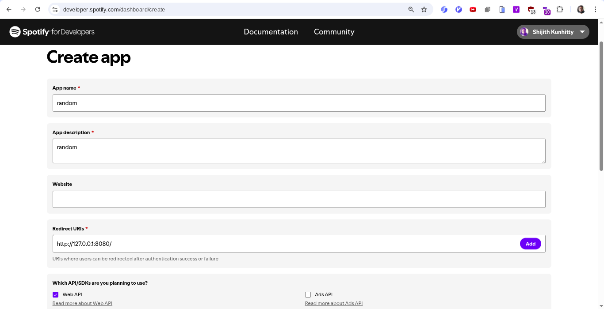
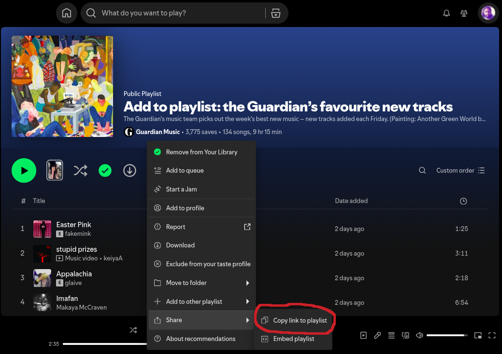

This is a simpler version of the aggregation script i wrote a few years back. 

What this version does is look through several playlists, get all the tracks added since last Saturday (midnight UTC) and add them all to one single playlist. 

These instructions for running the script are for Windows users and made with ChatGPT.

1. Install Python
	* Download latest Python 3.13.x from https://www.python.org/downloads/windows/
	* During setup check: Add Python to PATH

2. Create a project folder
	* Example: C:\music-discovery
	* Place aggregate_playlists.py there

3. Open Windows Terminal or PowerShell
   ```
   cd C:\music-discovery
   python -m venv .venv
   .\.venv\Scripts\activate
   python -m pip install --upgrade pip
   pip install spotipy
   ```

4. Create a Spotify app 
	- Go to https://developer.spotify.com/dashboard
	- Create a Spotify developer account if you need to 
	- Click Create App 
	- Fill the 'App name' and 'App description' fields with anything. 
	- For "Redirect URIs", use "http://127.0.0.1:8080/"
	- For the question "Which API/SDKs are you planning to use?", tick "Web API"
	- 
	- A Client ID and Client Secret get generated, add them to the script
	- Here's a [youtube video](https://www.youtube.com/watch?v=vm0tfTxG330) showing how to create client id and secret

5. Adding playlists
	- Add playlists to 'playlist_url_list' in the script.You can find the link for any playlist from its Spotify page. (Click the three dots, you get a sub-menu, click "Copy link to playlist")
	- 
	- You can also copy playlist urls from the [older repo](https://github.com/shijithpk/music-discovery/blob/master/playlist_ids_full.csv) 

6. Create playlist of your own
	- This playlist is where all the tracks from other playlists will get added.
	- So create a new playlist, copy the playlist url, and put it in 'final_playlist_url' in the script

7. First run (token cache)
   - On first run Spotify auth flow may open a URL or provide one to copy.
   - If browser does not auto-open, copy printed URL into a browser, log in, approve. You will get a redirect url, copy the full redirected URL back if Spotipy prompts (usually it auto-handles).
   - A .cache file will appear; keep it in same folder for future runs.

8. Run the script
   ```
   python aggregate_playlists.py
   ```
   - It will collect tracks added to the playlists from last Saturday onwards and put them all in one playlist

9. Scheduling with Task Scheduler
   - Open Task Scheduler -> Create Basic Task
   - Trigger: Weekly (e.g. Sunday)
   - Action: Start a program
	 Program/script: C:\Windows\System32\WindowsPowerShell\v1.0\powershell.exe
	 Arguments:
	   -ExecutionPolicy Bypass -NoLogo -NoProfile -Command "cd 'C:\music-discovery'; .\.venv\Scripts\activate; python aggregate_playlists.py"
   - Ensure Start in: C:\music-discovery
   - Make sure the user account has access and “Run whether user is logged on or not” if needed.
